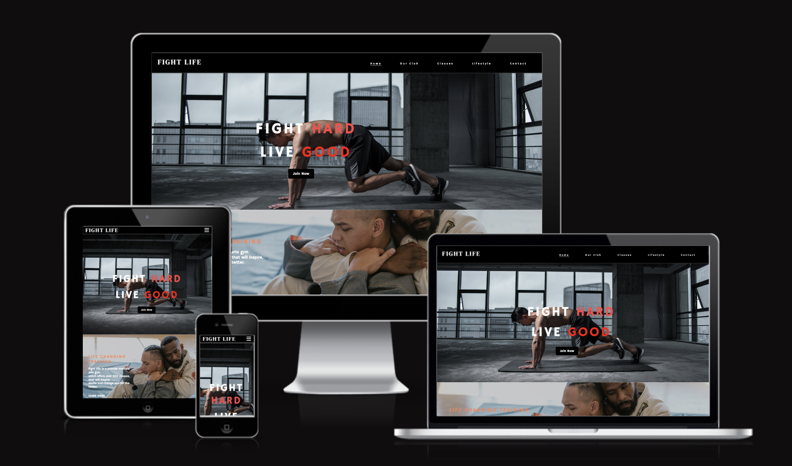
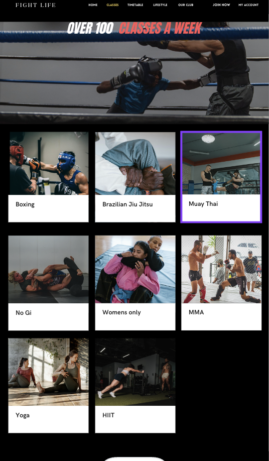
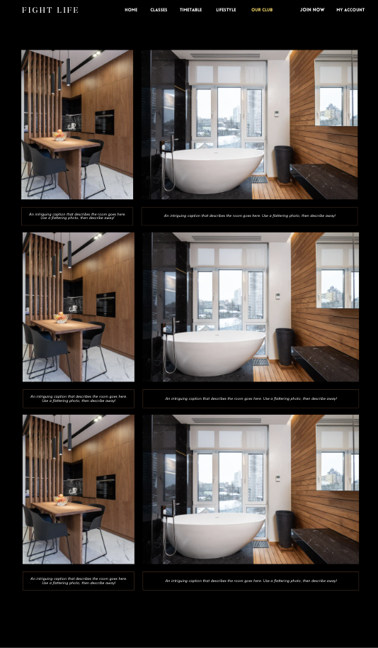
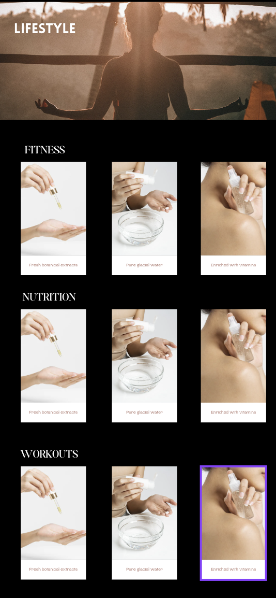
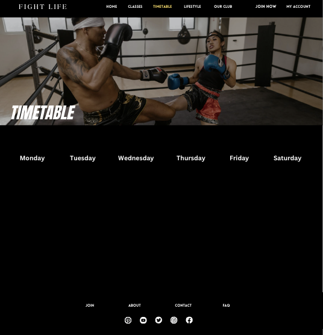

# **fight-life-project**
## **Site Overview**
Fight Life is a site designed to bring together martial arts enthusiasts, fitness seekers, and those looking for a holistic approach to well-being. Our goal is to provide a diverse range of martial art classes, foster a supportive community, and promote healthy lifestyles to complete beginners and seasoned fighters alike.

## Table of contents:
## **Introduction**
### **Target Audiences:**
* Users with a passion for martial arts, whether beginners or experienced practitioners seeking a training environment.
* Users looking for a fitness experience that differs from conventional health clubs, combining physical activity with skill development.
* Users that are new to the world of martial arts, providing a welcoming space for learning and development.
* Users interested in a holistic approach to wellness, including lifestyle tips for nutrition, mental well-being, and overall health
### **User Stories**
* As as a user I want to navigate across different pages easily
* As a user I want to see a variety of fitness classes to choose from
* As a user I want to know what the different classes are
* As a user I want a dedicated section for lifestyle and wellness tips.
  
### **Site aims**
* Showcase various martial arts classes available
* Be user friendly with easy navigation and clear information to attract users
* Offer not just fitness classes but also integrate lifestyle content, providing users with tips on nutrition, mental well-being, and a holistic approach
  
### **Wireframes**

I created low fidelity frames on figma to provide a skeleton and basic layout of the site. Following this I created high quality mock ups on canva that showed how the finished website would look. Below are the screenshots of the low fidelity wireframes and mock up.

* low fidelity wireframes
  * 
  * 
  * 
  * 
  * 
  * 
  * 
  * 

* High fidelity wireframes/mockups

 **Home Page**
  * 
  * 
  * 
  * 
  * 
  **Classes**
  * 
 **Club**
  * 
 **Lifestyle**
  * 
  **Timetable**
  * 

There are differences from the wireframes to the finished website:
  * The final web page has 4 navigation links in total: Home, Our Club, Classes and Contact.
  * There is no "What we offer" section on home page
  * There is no timetable page

### **Color Scheme:**

The color scheme for the majority of the website were black and white, blacks used for the background and white for text. The occasional light blue, coral and red were used for headings and links.

## Features 

In this section, you should go over the different parts of your project, and describe each in a sentence or so. You will need to explain what value each of the features provides for the user, focusing on who this website is for, what it is that they want to achieve and how your project is the best way to help them achieve these things.

### Existing Features

##  **Header Element**
The header element is at the top of the page containing the title of the page and navigation links that become highlighted and underlined once scrolled on and pressed to land on the selected link.

## **Title**

- __Navigation Bar__

  - The navigation will be on all four pages, it is responsive to desktop and mobile screens with links to the Home page, Club gallery, Classes and contact page.
  - Use of the navigation bar provides users the ease to move across different pages without having to backtrack.

The below image shows the navigation bar on mobile screens and links contained within the three bars icon that once pressed, will appear and collapse. It is designed to be repsonsive and easy to use.

The below image shows the navigation bar on desktop and larger screens with all links appearing across the header for easy access.

***

## Website  Overview
### Home Page
- The Landing/home page contains the responsive navigation at the top, a hero image with cover text overlay as a tagline and a CTA to serve as motivation. 
- Beneath this is another with an image and a short description on classes and the larger number of classes to choose from.
- Another section has a link to lifestyle tips with a call to action for the user to navigate to, where they will find resources that contribute to a healthier life. 
- The last section is a contact form to submit details and receive information on the club and signing up. At the bottom of the page is the footer which contains various social media links.

### Our Club Page
This page shows a visually engaging layout, featuring the following: 
- An embedded video background as the hero image that has play controls for the user and shows training that user will do, it will provide motivation and excitement to take part
- An image gallery with the gym space for the user to view
  

### Classes Page
- The "Classes" section, provides users with a comprehensive overview of diverse martial artsaccompanied by engaging visuals and  descriptions. Users can view this on a well-structured and informative layout, helping them in making informed decisions about the variety of classes available. 

### Lifestyle Page
This contains the "Lifestyle" section, offering users an  experience to elevate their well-being. The user presses a call-to-action button which encourages users to explore more about adopting a healthier lifestyle leading to an external site with resources to do so.
[Lifestyle page](assets/screenshots/Lifestyle%20page.png)

### Contact Page
This page allows users to view Fight Life's contact details and submit inquiries on a user-friendly contact form.
[Contact page](assets/screenshots/Contact%20page.png)

### The Footer 

  - The footer provides quick access to Fight Life's social media platforms via icons, inviting users to stay connected through Facebook, Twitter, YouTube, Instagram, and Spotify. 
  - The icons were imported from Font Awesome
 [Footer Image page](assets/screenshots/Footer%20image.png)

## Testing 

### Validator Testing  

W3C was used to validate the HTML and CSS with direct input.

- HTML
  - No errors were found when passing through the W3C validator [W3C validator](assets/screenshots/W3C%20validated%20html.jpeg)
  
- CSS
  - No errors were found when passing through the CSS validator [(Jigsaw) validator](assets/screenshots/CSS%20validated.png)

### Lighthouse

Performance testing from Lighthouse was used to assess the website, including performance, SEO, accessibility, and best practices.

### Home Page

### Club Page

### Classes Page

### Lifestyle Page

### Contact Page

Mobile version

## Deployment

This section should describe the process you went through to deploy the project to a hosting platform (e.g. GitHub) 

- The site was deployed to GitHub pages. The steps to deploy are as follows: 
  - In the GitHub repository, navigate to the Settings tab 
  - From the source section drop-down menu, select the Master Branch
  - Once the master branch has been selected, the page will be automatically refreshed with a detailed ribbon display to indicate the successful deployment. 

The live link can be found here - https://code-institute-org.github.io/love-running-2.0/index.html 

## Credits 

In this section you need to reference where you got your content, media and extra help from. It is common practice to use code from other repositories and tutorials, however, it is important to be very specific about these sources to avoid plagiarism. 

You can break the credits section up into Content and Media, depending on what you have included in your project. 

### Content 

- The text for the Home page was taken from Wikipedia Article A
- Instructions on how to implement form validation on the Sign Up page was taken from [Specific YouTube Tutorial](https://www.youtube.com/)
- The icons in the footer were taken from [Font Awesome](https://fontawesome.com/)

### Media

- The photos used on the home and sign up page are from This Open Source site
- The images used for the gallery page were taken from this other open source site

